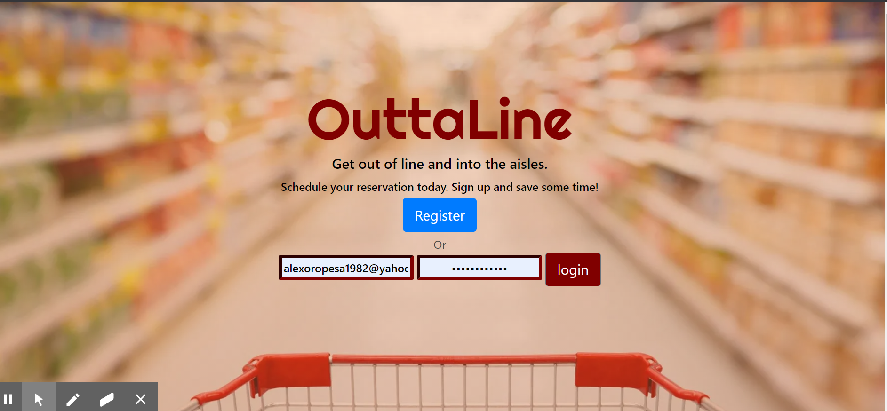
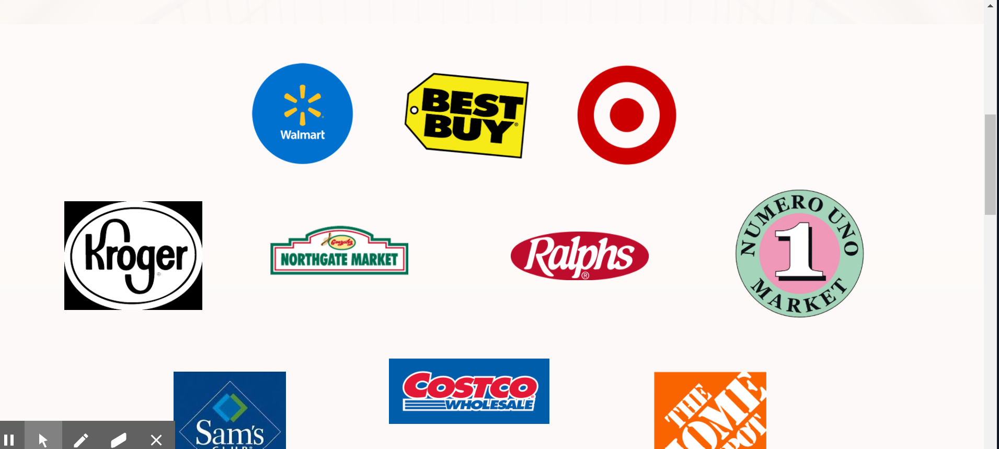
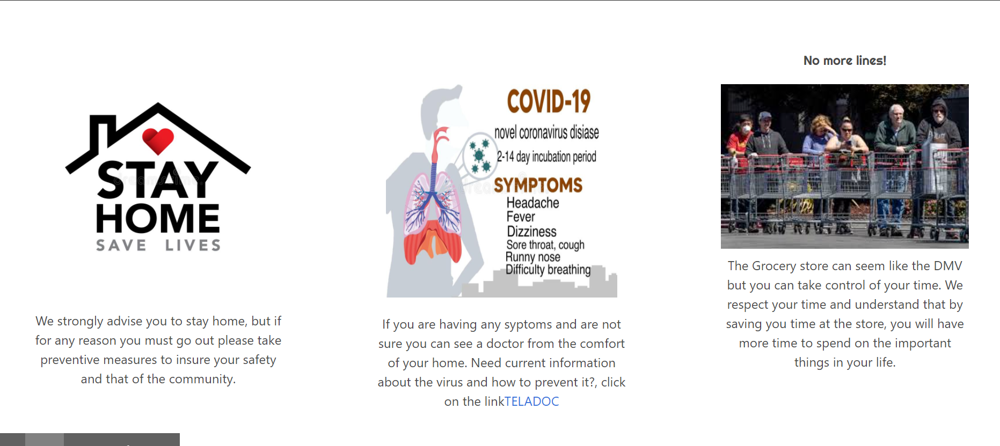
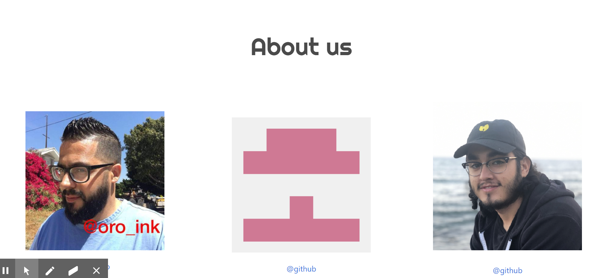
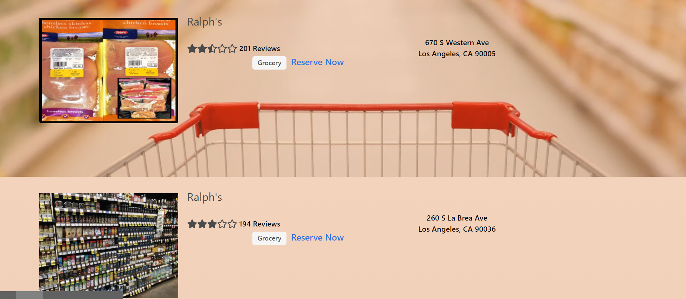
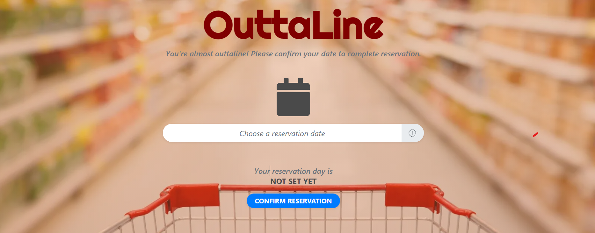

# OuttaLine

## Description

---

As a post pandemic grocery shopper
I want to be able to log in and access the search bar to search for grocery stores
So that I can find the nearest one in my area and make a reservation to shop without the hassle of a wait line.

## Table of content

---

- [Description](#description)
- [Table of content](#table-of-content)
- [Installation](#installation)
- [Setup](#setup)
- [Deploying](#deploying)
- [Contributing](#contributing)
- [Support/Questions](#supportquestions)
- [License](#license)

## Installation

---

> **_get started_**:

- react js
- node js
- mongodb
- MERN boiler-plate

## Setup

---

- npm
- npm install
- npm i express
- npm i mangoose
- npm morgan
- npm session
- npm yarn

---

---

---

---

---

---

---

## Deploying

---

- Heroku

> **_Find me on Github:_**

**_At Github:_**
<https://github.com/Rauloropesa3/project3Final.git>

**_Check out the Outtaline App Video_**
<https://drive.google.com/file/d/1Jxpq7Q5QuueEYSNeep9SaAhbtykvLTU3/view>

**_Or just test out the app_**
<https://powerful-garden-84804.herokuapp.com>

## Contributing

---

**_step 1_**

- **Option 1**

  - Fork this repo!

- **Option 2**
  - Clone thr repo to your local machine

**_step 2_**

- Hack Away!!!
- Create a new pull request

## Support/Questions

---

Reach out to me if you have any questions!

- Via email:
  - alexoropes1982@yahoo.com

## License

---

- MIT License

  <https://opensource.org/license/>

  >
